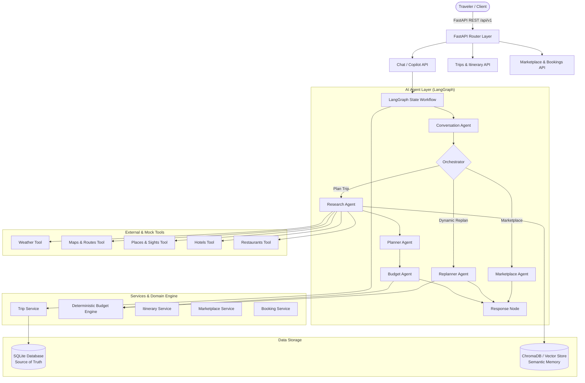

# Friday 🏔️

**AI Travel Copilot + Trusted Travel Marketplace for Pakistan**

> *"Friday doesn't just tell you where to go — it plans the trip, adapts when things change, organizes your group, and connects you with trusted local organizers to make it happen."*

---

## 🌟 What is Friday?

**Friday** is a next-generation AI travel copilot and marketplace tailored specifically for travel in Pakistan. From multi-day expeditions to Hunza and Skardu to weekend getaways in Swat and Murree, Friday combines conversational AI, real-world travel research, deterministic budget calculations, dynamic replanning, and direct integration with verified local tour operators.

---

## 🚀 Core Features

- **🤖 AI Trip Planning & Roman Urdu Understanding**: Understands colloquial natural language inputs such as *"Mujhe 5 friends ke sath 4 din ke liye Hunza jana hai, budget 40k per person hai"* and automatically extracts destinations, durations, group sizes, and budget constraints.
- **🔍 Real-World Destination Research**: Queries weather advisories, mountain route accessibility, historical sites, hotel rates, and local dining across Pakistan.
- **⚡ Dynamic Replanning**: Modify constraints on the fly (e.g. *"Budget 30k kar do"*) — Friday detects affected components, optimizes hotel/transport tiers, recalculates deterministic budgets, and increments trip versions without discarding your plan.
- **💰 Deterministic Budget Engine**: Pure Python arithmetic engine that guarantees exact breakdowns (transportation, accommodation, food, activities, miscellaneous) without LLM calculation hallucinations.
- **👥 Group Travel & Permissions**: Multi-user trip collaboration with OWNER and MEMBER roles, shared itineraries, and consolidated budgets.
- **🛡️ Verified Marketplace**: Scores and matches verified local Pakistani tour operators (e.g. *Hunza Explorers*, *Karakoram Journeys*) based on ratings, price compatibility, and destination presence.
- **📝 Booking Requests**: Frictionless booking pipeline linking travelers directly to operator packages.

---

## 🏛️ Architecture

Friday is built as a **modular monolith** with clean layer separation:



---

## 📁 Repository Structure

```
├── backend/
│   ├── app/
│   │   ├── api/v1/          # FastAPI routers (chat, trips, itinerary, budget, groups, organizers, packages, bookings)
│   │   ├── agents/          # AI agents (orchestrator, conversation, research, planner, budget, replanner, marketplace, booking)
│   │   ├── graph/           # LangGraph workflow, state definitions, and execution nodes
│   │   ├── tools/           # Provider-independent research tools (weather, maps, places, hotels, restaurants, web_search)
│   │   ├── database/        # SQLAlchemy engine, declarative base, session factories, and initial seed logic
│   │   ├── models/          # SQLAlchemy ORM models (User, Trip, Itinerary, Day, Activity, Budget, Organizer, Package, Booking, AgentRun)
│   │   ├── schemas/         # Pydantic v2 schemas and validation models
│   │   ├── services/        # Core business logic and deterministic calculation services
│   │   ├── repositories/    # Clean data access layer (UserRepository, TripRepository, OrganizerRepository, BookingRepository)
│   │   ├── vector_store/    # ChromaDB & semantic vector store abstraction with embedding providers
│   │   ├── core/            # Configuration, user context dependencies, exceptions, and structured logging
│   │   ├── utils/           # Date and ID utility helpers
│   │   └── main.py          # FastAPI application entry point with lifecycle and middleware
│   ├── data/                # SQLite database and vector storage directory
│   ├── .env.example         # Environment template
│   ├── requirements.txt     # Pinned Python dependencies
│   ├── Dockerfile           # Production container configuration
│   └── docker-compose.yml   # Multi-service container orchestration
├── scripts/                 # CLI seed scripts and travel knowledge ingestion utilities (outside backend)
├── tests/                   # Pytest test suite (outside backend)
├── pytest.ini               # Pytest configuration
└── README.md                # Project documentation
```

---

## 🧰 Tech Stack

| Component | Technology |
|---|---|
| **Language** | Python 3.12+ |
| **API Framework** | FastAPI |
| **Data Validation** | Pydantic v2 & Pydantic-Settings |
| **ORM & Database** | SQLAlchemy 2.0 & SQLite (aiosqlite) |
| **Vector Store** | ChromaDB / VectorStore Abstraction |
| **Agent Orchestration** | LangGraph & LangChain Core |
| **Testing** | Pytest & pytest-asyncio & HTTPX |
| **Containerization** | Docker & Docker Compose |

---

## ⚙️ Setup & Installation

### 1. Create and Activate Virtual Environment

**Windows:**
```powershell
python -m venv .venv
.venv\Scripts\activate
```

**macOS/Linux:**
```bash
python3 -m venv .venv
source .venv/bin/activate
```

### 2. Install Dependencies

```bash
pip install -r backend/requirements.txt
```

### 3. Initialize & Seed Database

```bash
python scripts/seed_data.py
python scripts/ingest_travel_data.py
```

### 4. Start the Server

```bash
cd backend
uvicorn app.main:app --reload --host 0.0.0.0 --port 8000
```

---

## 📖 API Documentation

FastAPI provides interactive OpenAPI documentation:

- **Swagger UI**: [http://localhost:8000/docs](http://localhost:8000/docs)
- **ReDoc**: [http://localhost:8000/redoc](http://localhost:8000/redoc)
- **Health Check**: [http://localhost:8000/health](http://localhost:8000/health)

---

## 🧪 Running Tests

Run the full automated test suite using `pytest` from the root directory:

```bash
pytest -v
```

Tests cover:
- **`test_trips.py`**: Trip creation, user listing, member permissions.
- **`test_itinerary.py`**: Auto-generated day/activity schedules.
- **`test_budget.py`**: Deterministic budget arithmetic and over-budget alerts.
- **`test_replanning.py`**: Dynamic replanning from 40k to 30k per person with version tracking.
- **`test_tools.py`**: All 7 mock tools (weather, maps, places, hotels, restaurants, web search, organizers).
- **`test_marketplace.py`**: Organizer matching and compatibility scoring.
- **`test_bookings.py`**: Booking creation and state transitions.

---

## 💡 Running Without Paid API Keys (Mock Mode)

Friday includes built-in mock providers for LLM responses, embeddings, weather, maps, and travel data. You can run the entire copilot, planner, replanner, and marketplace **offline without incurring API charges or needing paid keys**.
